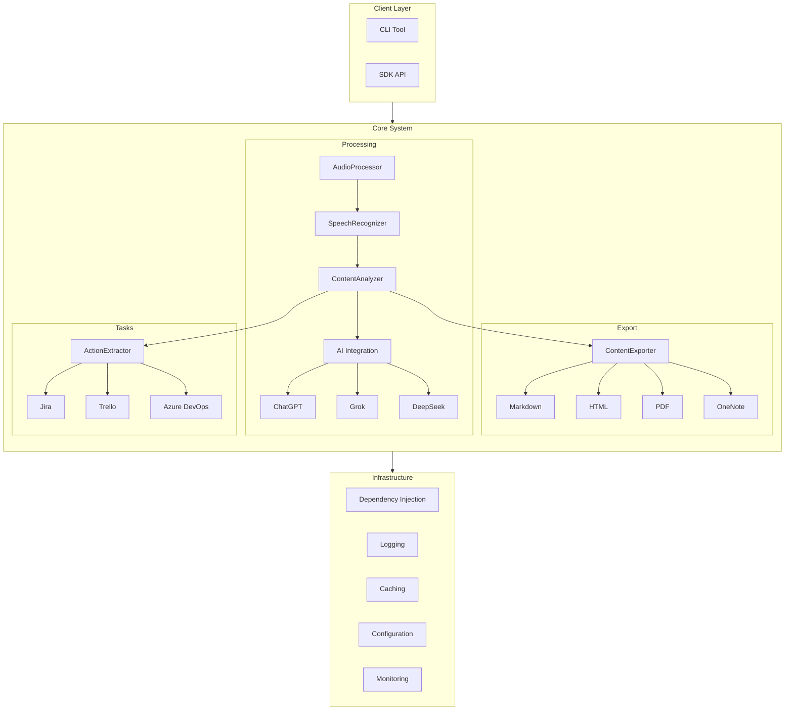
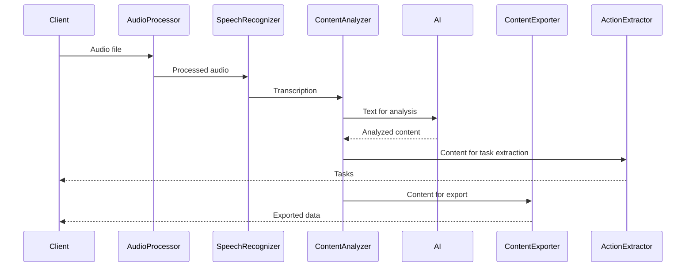
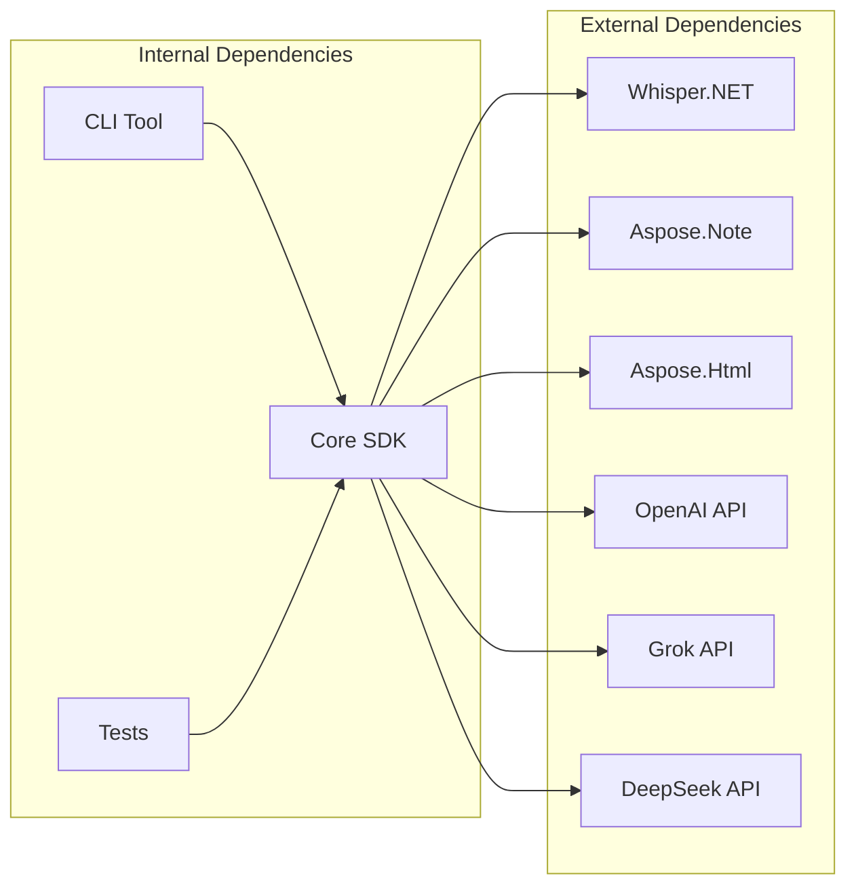
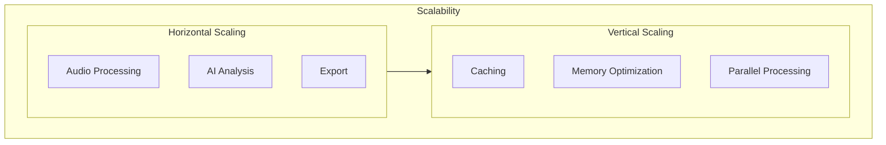
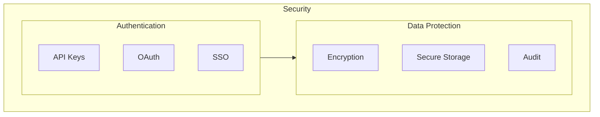

# Architecture of Aspose.MeetingNotes-for-.NET

## General Architecture

## System Components

### 1. Client Layer
- **CLI Tool**: Command-line application for working with the SDK
- **SDK API**: Main interface for integration with other applications

### 2. Core System

#### 2.1 Processing
- **AudioProcessor**: Audio file processing
- **SpeechRecognizer**: Speech recognition using Whisper
- **ContentAnalyzer**: Content analysis and structuring
- **AI Integration**: AI model integration
  - ChatGPT
  - Grok
  - DeepSeek

#### 2.2 Export
- **ContentExporter**: Export to various formats
  - Markdown
  - HTML
  - PDF
  - OneNote

#### 2.3 Tasks
- **ActionExtractor**: Task extraction and management
  - Jira integration
  - Trello integration
  - Azure DevOps integration

### 3. Infrastructure
- **Dependency Injection**: Dependency management
- **Logging**: Logging system
- **Caching**: Result caching
- **Configuration**: Configuration management
- **Monitoring**: System monitoring

## Data Flow

## Dependencies

## Scalability

## Security

