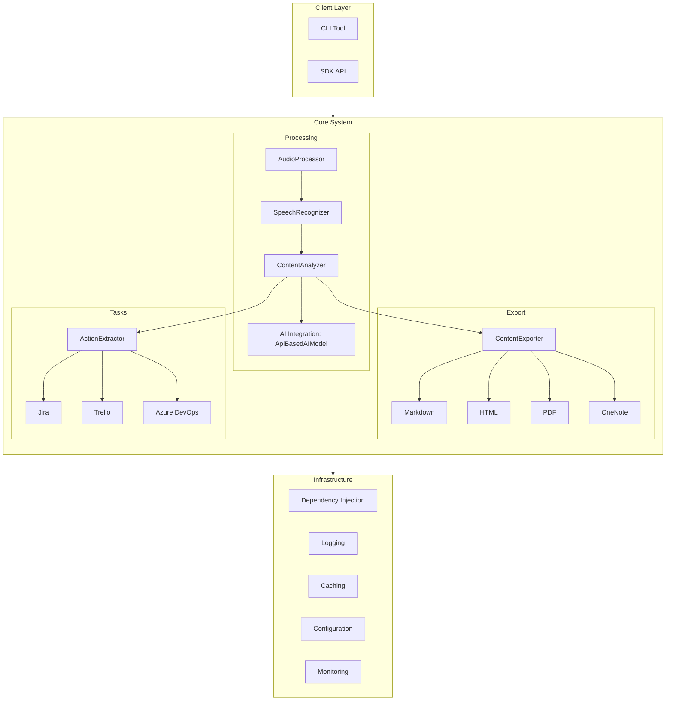
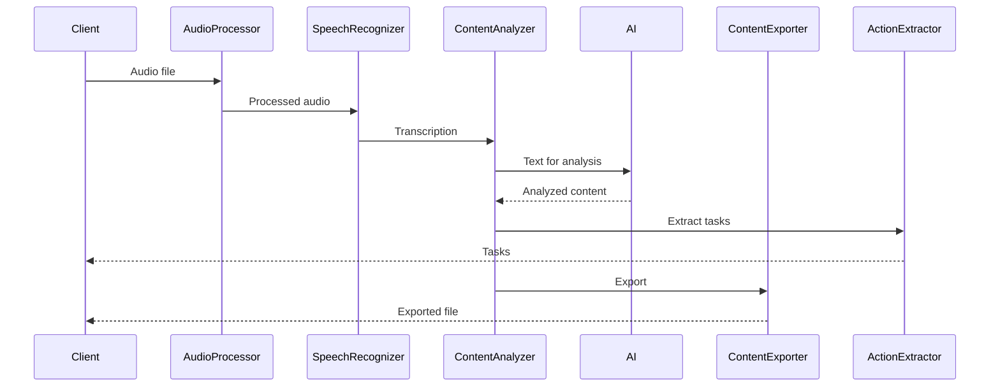
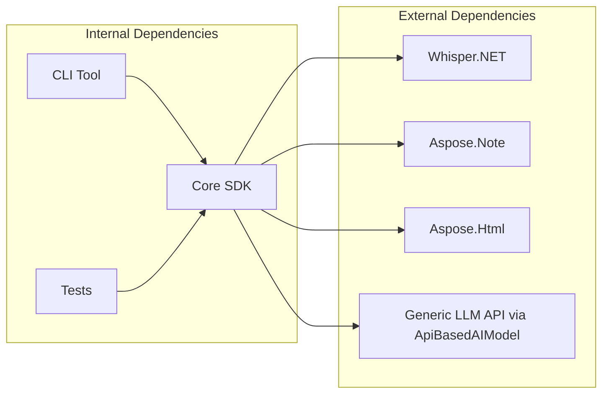
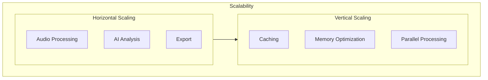
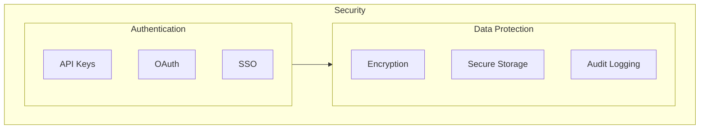

# Aspose.MeetingNotes Architecture

## General Architecture

## System Components

### 1. Client Layer
- **CLI Tool**: Command-line interface for processing and exporting meeting notes
- **SDK API**: Entry point for external integrations

### 2. Core System

#### 2.1 Processing
- **AudioProcessor**: Handles audio preprocessing using `ffmpeg`
- **SpeechRecognizer**: Performs transcription using Whisper
- **ContentAnalyzer**: Analyzes transcribed text for structure and insights
- **AI Integration**: Uses `ApiBasedAIModel` with configurable `AIModelOptions`

#### 2.2 Export
- **ContentExporter**: Converts analysis results into various formats
  - Markdown
  - HTML
  - PDF
  - OneNote

#### 2.3 Tasks
- **ActionExtractor**: Extracts tasks and action items from content
  - ⚠ Planned: Integrations with Jira, Trello, Azure DevOps

### 3. Infrastructure
- **Dependency Injection**: Service configuration and wiring
- **Logging**: Centralized logging via `ILogger`
- **Caching**: Placeholder for potential performance improvements
- **Configuration**: Supports JSON file and environment/CLI overrides
- **Monitoring**: ⚠ Planned: runtime health and diagnostics

## Data Flow

## Dependencies

## Scalability

## Security

